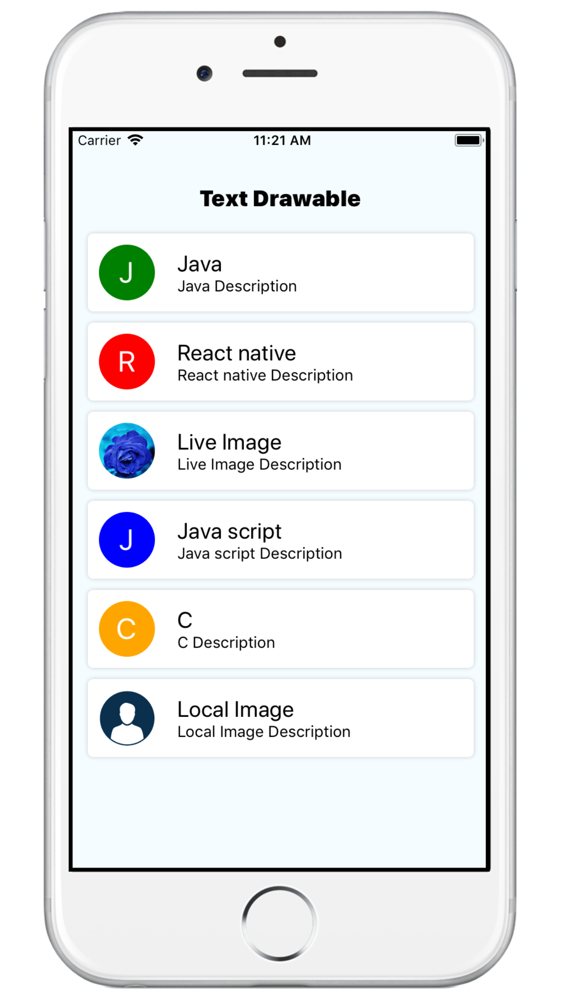
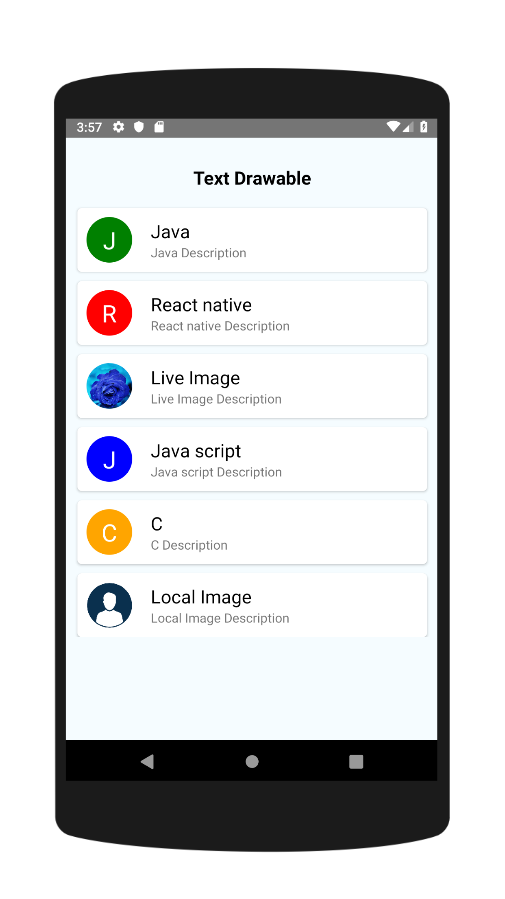

[](http://hits.dwyl.io/colbymillerdev/react-native-progress-steps)
[](http://makeapullrequest.com)

# text-drawable

A simple and fully customizable React Native component that implements a Text drawable. 


iPhone Screen             |  Android Screen
:-------------------------:|:-------------------------:
| 


## Installation

If using yarn:

```
yarn add text-drawable
```

If using npm:

```
npm i text-drawable
```

## Usage

```
import { ProfileThumbnail, ThumbnailList } from 'text-drawable';
```

Simply place a `<ThumbnailList />` tag with parameter.
Drawable container and text are fully customizable using the `textStyle, titleStyle, and descriptionStyle` props.
```
<View style={{flex: 1}}>
    <ThumbnailList data={[
            {
                title: "Java",
                description:"Java Description",
                backgroundColor:"green",   
            },
            {
                title: "React native",
                backgroundColor:"red",   
            },
            {
                title: "Javaascript",
                backgroundColor:"blue",   
            }
        ]} 
        label="A" 
        backgroundColor="green"/>
      </View>
</View>
```

### ProfileThumbnail

Example usage to change a single drawable image: 

```

return (
    <View style={{flex: 1}}>
     <ProfileThumbnail
       label="A" 
        backgroundColor="green"/>
    </View>
)

```

## Documentation

### ProfileThumbnail Component
| Name                      | Description                                | Default     | Type   |
|---------------------------|--------------------------------------------|-------------|--------|
| label                     | Display First character of label           | optinal     | String |
| size                      | Size of text drawable                      | 50          | Number |
| backgroundColor           | Back ground color of text drawable         | green       | String |
| imageURL                  | Add image url to load image from url       | optinal     | String |
| localImage                | Add local path to display image from local | optinal     | object |
| textStyle                 | Text drawable style for text               | optinal     | object |


### ThumbnailList Component
| Name | Description | Default | Type |
|------------------|--------------------------------------------------------------------------|----------|---------|
| label | Display First character of label string | optinal | String |
| size | height and width of text drawable view | 50 | Number |
| backgroundColor | backgroundColor of text drawable view | optinal | String |
| imageURL | Add image url to load image from url | optinal | String |
| localImage | Add local path to display image from local(like require("image path")) | optinal | object |
| textStyle |  Text drawable style for text | optinal | String |
| descriptionStyle |  Add style for description text | optinal | String |
| titleStyle | Add title style for title text | optinal | String |
| data | Pass array for display list| [{ title: "Java", description:"Java Description", backgroundColor:"green",}, {title: "React native", description:"React native Description", backgroundColor:"red"}] | Array |

## Contributing
Pull requests are always welcome! Feel free to open a new GitHub issue for any changes that can be made.

## Author
Aniruddh Kukadiya

## License
[ISC]
# TextDrawable
